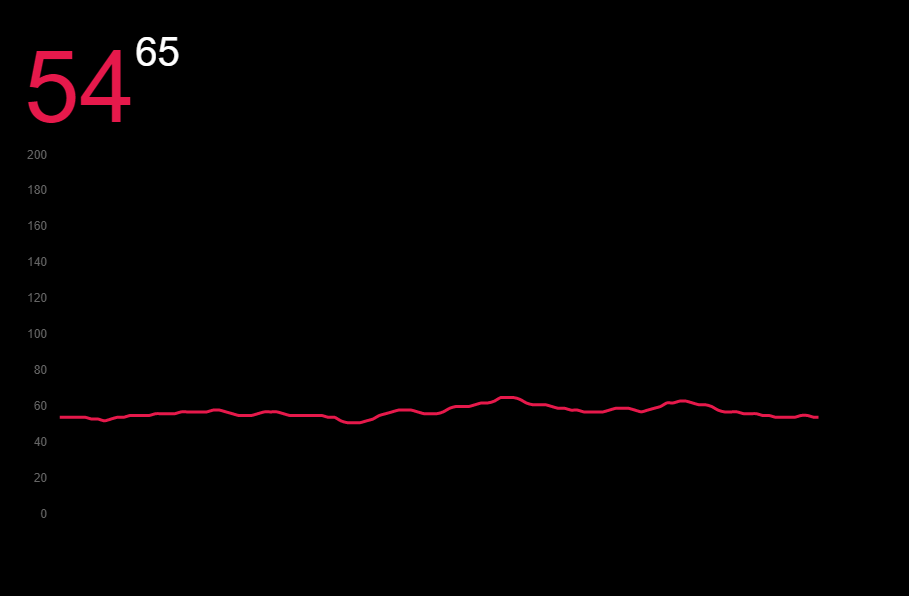

# BLE HR Monitor

Application for monitoring heart rate with BLE heart rate sensors.

This application was mainly created for showing heart rate in SteamVR.
The window is transparent, and you can remove the borders by double-clicking on the window.
Then you can add it as a transparent floating window inside SteamVR.

Currently, there is no way to configure which device to use, and no error messages
are shown when something unexpected happens. Contributions are welcome.



## Features

* Automatically read heart rate measurements from the first available heart rate device
* Show current and maximum heart rate, and graph of heart rate values from the last two minutes

## Development

1. Set up your development environment for Tauri: https://tauri.studio/en/docs/getting-started/intro
2. Install Tauri CLI
   ```
   cargo install tauri-cli --version ^1.0.0-beta
   ```
3. Install front-end dependencies
   ```
   npm install
   ```
4. Build and launch the app with hot-reloading enabled 
   ```
   cargo tauri dev
   ```